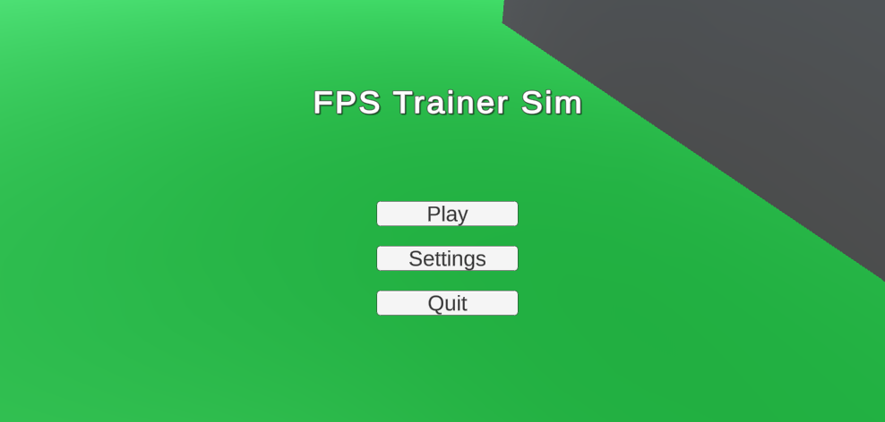
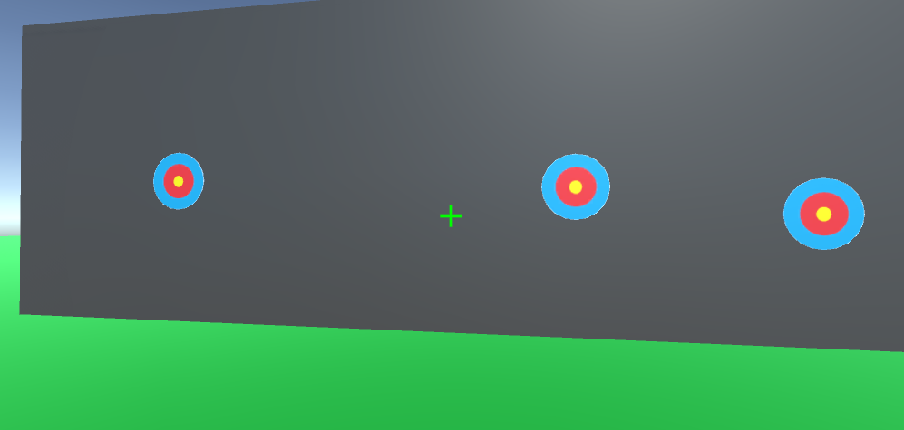
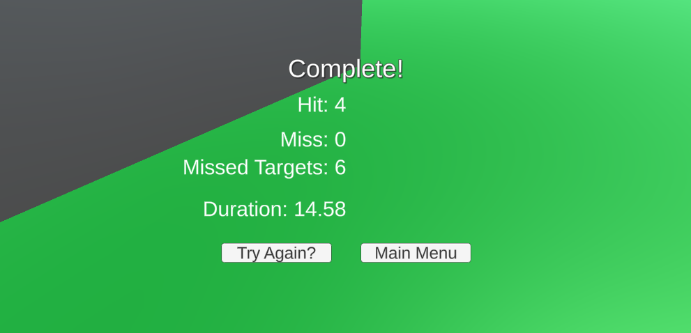
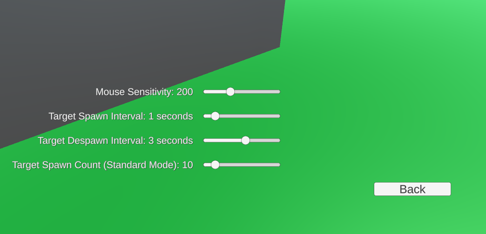

# fps-trainer-sim
A simple target shooting game made with Unity with the goal of improving aim in first-person-shooter games.

## Features
### Game modes:
* **Standard:** A set number (default of 10) is spawned. The game ends when the limit is reached.
* **Survival:** An infinite number of targets are spawned. The game ends when the player fails to hit a target before it despawns.
* **Frenzy:** An infinite number of targets are spawned, and the spawn rate gradually increases. The game ends when the player fails to hit a target before it despawns.

### Settings:
Settings are controlled through sliders in the settings menu.

## Screenshots

### Menu

### Gameplay

### Results

### Settings

